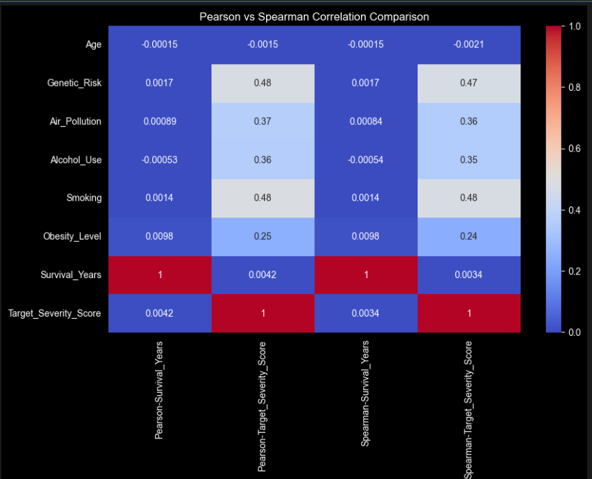

# Global Cancer Analytics

## Project Overview
This project analyzes global cancer patient data to uncover patterns in demographics, risk factors, treatment costs, and survival outcomes using exploratory, statistical, and inferential data analysis techniques.

The goal is to understand factors influencing cancer severity, survival outcomes, and economic burden to support data-driven healthcare insights.

---

---

## 📷 Sample Analysis Visualization

<p align="center">
  
</p>

## ✅ Project Status
✅ Project Completed — Analysis, insights, and recommendations finalized.

---

## 📊 Key Findings

- Lifestyle and genetic factors show stronger associations with cancer severity.
- Around 40% of cancers are diagnosed at early stages across cancer types.
- Treatment costs vary significantly across countries and age groups, highlighting global healthcare inequalities.
- No statistically significant relationship was found between treatment cost and survival years.
- Cancer outcomes are influenced by multiple interacting factors rather than a single dominant variable.

---

## 📁 Project Structure

```
global-cancer-analytics/
├── data/
│   └── raw/
│       └── global_cancer_patients.csv
├── notebooks/
│   ├── 01_data_understanding.ipynb
│   ├── 02_data_validation.ipynb
│   ├── 03_inferential_analysis.ipynb
│   └── 04_insights_and_recommendations.ipynb
└── README.md
```


---

## 📂 Dataset

The dataset used in this project is a global cancer patient dataset obtained from Kaggle for educational and analytical purposes.

It contains demographic information, lifestyle risk factors, cancer stages, treatment costs, and survival outcomes for approximately 50,000 patients across multiple countries.

---

## 🛠️ Tools & Technologies

- Python
- Pandas
- NumPy
- Seaborn & Matplotlib
- Statistical Analysis (Correlation & Hypothesis Testing)
- Jupyter Notebook

---

## 📈 Analytical Approach

The project followed a structured analytical workflow:

1. Data Understanding and Exploration  
2. Data Validation and Quality Checks  
3. Inferential Statistical Analysis  
4. Hypothesis Testing  
5. Economic and Demographic Analysis  
6. Insight Generation and Recommendations

---

## 💡 Business & Healthcare Impact

The analysis highlights the importance of early cancer detection, preventive healthcare strategies, and efficient healthcare systems in reducing both medical severity and financial burden.

The findings emphasize that higher healthcare spending alone does not guarantee improved survival outcomes.

---

## 🔮 Future Improvements

- Predictive modeling using machine learning
- Survival prediction models
- Integration of additional clinical datasets
- Interactive dashboard development (Power BI / Tableau)

---

---

## 👤 Author

**Pratham Mewara**  
Data Analyst  

Skills: Python | SQL | Data Analysis | Data Visualization  

GitHub: [github.com/mewara54321](https://github.com/mewara54321)